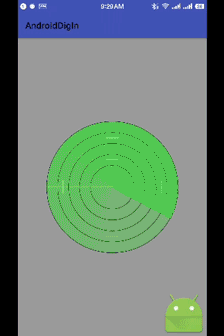
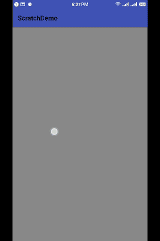
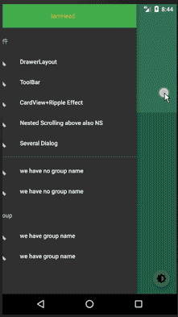
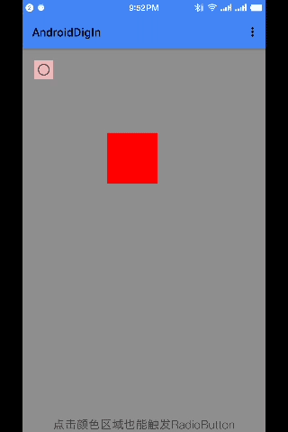
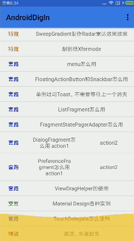

# Halohoop Android Skill Dig In
## 1.Magifier，放大镜效果

* Matrix的使用；
* 求大小两圆切点，数学几何；
* ShapeDrawable的使用；
* BitmapShader的使用；

## 2.[歌词走马灯](https://github.com/halohoop/PartsShowTextView)

* LinearGradient的使用;
* Matrix的使用(setTranslate);
* Paint.measureText();
* Paint.setShader();
* onDraw中循环调用postInvalidateDelayed；

## 3.理解ColorMatrix

* ColorMatrix的使用；
* 色调setRotate
* 饱和度setSaturation
* 亮度setScale
* 集中特殊的处理（如：灰度、反相、怀旧、去色、高饱和）

## 4.Reveal效果

* 代码自定义drawable，内存画布;
* Gravity.apply的使用，从Rect扣出另一个Rect;
* canvas.clipRect裁剪画布，限定绘制区域；
* canvas.save();和canvas.restore();的使用;
* Drawable的setLevel以及onLevelChange的使用;
* Drawble重绘调用invalidateSelf;

## 5.RadialGradient实现水波纹效果

* RadialGradient的使用，也是shader的一种（子类）;
* BitmapShader的使用;
* ComposeShader的使用;
* ComposeShader结合PorterDuff.Mode的使用;

## 6.SweepGradient制作Radar雷达效果效果

* SweepGradient的使用，也是shader的一种（子类）;
* 果冻效果;
* onDraw中调用invalidate的方式做循环;

## 7.刮刮纸ScratchView

* Xfermode的使用;
* Xfermode生效可能需要关闭硬件加速setLayerType(LAYER_TYPE_SOFTWARE, null);
* Xfermode生效可能需要Canvas.saveLayer;
* 让笔触更加平滑的算法quadTo;
* 自创的加解密一个文件的方法，把文件放到raw中，然后用流解析;

## 8.menu怎么用

* 重写方法onCreateOptionsMenu;
* R.menu.main_menu  xml中定义点击事件;

## 9.FloatingActionButton和Snackbar怎么用

* SnackBar可以右滑dismiss；

具体还可以查看这个属性：[SwipeDismissBehavior](https://developer.android.com/reference/android/support/design/widget/SwipeDismissBehavior.html)

## 10.单例吐司Toast，不需要等待上一个消失
## 11.ListFragment怎么用

* 调用setListAdapter设置适配器；
* 重写onListItemClick调用点击时间；
* 布局的listview的id必须为@android:id/list；

## 12.FragmentStatePagerAdapter怎么用

* 重写Fragment getItem(int position)；
* 重写int getCount()；
* 将实例传给ViewPager，ViewPager.setAdapter；

## 13.DialogFragment怎么用

* 重写方法onCreateDialog，可以构造一个AlertDialog作为返回值，此方法在onCreate之后onCreateView之前;
* 重写方法onCreateView，可以构造一个View作为返回值,然后定义点击时间;
* 显示需要调用DialogFragment的show()方法
* 设置能否取消是要设置DialogFragment的setCancelable方法才会生效，这个对于重写onCreateDialog和重写方法onCreateView都生效;

## 14.PreferenceFragment怎么用

* 继承PerferenceFragment；
* 定义res/xml，其中的key就是可以获取到默认sp中值的key。
#####
	<?xml version="1.0" encoding="utf-8"?>
	<PreferenceScreen xmlns:android="http://schemas.android.com/apk/res/android">
	    <EditTextPreference
	        android:key="username"
	        android:summary="Please provide your username"
	        android:title="Your Name" />
	</PreferenceScreen>

* 获取到默认sp:
#####
	SharedPreferences defaultSp = PreferenceManager.getDefaultSharedPreferences(this);

## 15.Material Design各种实例（不断更新）

**LOLLIPOP ONLY**

* 沉浸式状态栏（状态栏着色）；
* DrawerLayout的使用；
* NavigationView的使用；
* CardView的使用；
* CardView+Ripple效果；
* Snackbar的使用；
* FloatingActionButton的使用；
* Toolbar替换ActionBar；
* CoordinatorLayout+AppBarLayout+CollapsingToolbarLayout+Toolbar；

	1. 解决CollapsingToolbarLayout和沉浸式状态栏的问题，[使 CollapsingToolbarLayout 与 StatusBar 完美共存。](http://tonyzzx.github.io/2015/09/08/CollapsingToolbarLayout-StatusBar/)

## 16.TouchDelegate怎么用

* 当需要为一个很小的view扩大其点击区域的时候，可以用TouchDelegate! 

## 17.波浪，水涨起来效果 Path.rQuadTo

* WaveView.java； 
* 波浪两个周期重置才能无缝衔接； 
* 建议将一个波浪的数据编程一个bean； 

## 18.如何在一个独立的类中如何拿到主线程

    Handler handler = new Handler(Looper.getMainLooper());//线程切换

## 19.VelocityTracker的使用

* 通过onTouchEvent获取速度，x轴方向和Y轴方向；
* 每个手机都有最大的fling速度，设计自定义view的时候，如果超过了可能会让CPU忙不过来，所以通过设置获取一下：

        int mMaxVelocity = ViewConfiguration.get(getContext()).getMaximumFlingVelocity();

## 20.FragmentManager的popBackStack的使用

* 用法：

        //自己以上所有，不包括自己
        getSupportFragmentManager().popBackStack("rt", 0);
        //自己以上所有，包括自己
        getSupportFragmentManager().popBackStack("rt", 1);
        //最上层的一个
        getSupportFragmentManager().popBackStack(null, 0);
        //最上层的一个
        getSupportFragmentManager().popBackStack();
        //全部pop
        getSupportFragmentManager().popBackStack(null, 1);

* 注意：popBackStack传入的第一个参数是addToBackStack(name)传入的参数，而不是Fragment的Tag；

## 21.To be continued...

## License

    Copyright 2017, Halohoop

    Licensed under the Apache License, Version 2.0 (the "License");
    you may not use this file except in compliance with the License.
    You may obtain a copy of the License at

       http://www.apache.org/licenses/LICENSE-2.0

    Unless required by applicable law or agreed to in writing, software
    distributed under the License is distributed on an "AS IS" BASIS,
    WITHOUT WARRANTIES OR CONDITIONS OF ANY KIND, either express or implied.
    See the License for the specific language governing permissions and
    limitations under the License.